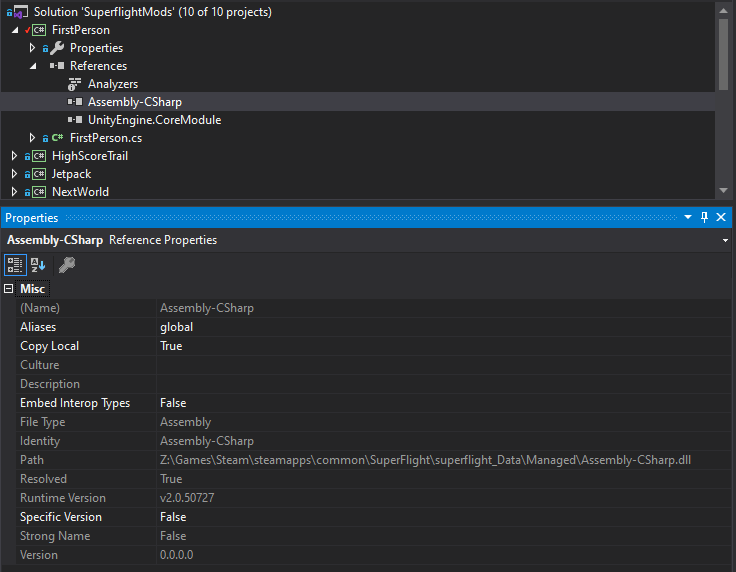

# Developing Mods

## Prerequisites

- SFMF is installed on your machine
- SFMF is injected into the game (the "Install SFMF" button inside the application)

## Creating Your Own Mod

### Visual Studio Setup

Once you've got a new project created in Visual Studio, you'll need to add references to the game file and Unity's core module.

Here is where each of those files will be located. Generally you can find these in your steam installation directory (`...\steam\steamapps\common`).

```
Assembly-CSharp -> ...\SuperFlight\superflight_Data\Managed\Assembly-CSharp.dll
UnityEngine.CoreModule -> ...\SuperFlight\superflight_Data\Managed\UnityEngine.CoreModule.dll
```

Here's an example of the reference in one of my mods:



### A Simple Mod

Now that you've got your references set up properly, you'll have access to Unity's game loop and all of the game's classes.

Let's recreate my mod that limits a player's minimum speed, so you can fly straight up without running out of speed.

```c#
using SFMF;
using System;

namespace UnlimitedFlight
{
    // IMod is an interface exported by SFMF and it must be included. That's how SFMF knows which .dlls
    // can actually be loaded into the game.
    public class UnlimitedFlight : IMod
    {
        public void Update()
        {
            // PlayerMovement is a class written by the Superflight developers and gives you access to
            // a number of player attributes regarding player movement (weird.. I know).
            PlayerMovement.Singleton.currentSpeed = Math.Max(800, PlayerMovement.Singleton.currentSpeed);
        }
    }
}
```

### Loading Your Own Mod

Once your're ready to try your mod out, you can open SFMF, go to `File > Import Local Mod` and navigate to the .dll that was output when you built your mod. In my case:

```
C:\Users\vic\Documents\projects\games\Superflight-Mods\UnlimitedFlight\bin\Debug\UnlimitedFlight.dll
```

Once that's loaded, you should be able to rebuild changes to your mod and have the new version loaded next time you start Superflight.

*Note:* Things get a bit trickier when your mod uses settings. You'll need to manually place your mod's settings file in the correct location (that should be specified inside your mod).

### Publishing Your Mod

There are a couple ways you can get your mod to players:

1. Publish your mod as a .dll that playerscan download and load as a local mod (same as above).
2. Publish your mod as a .dll and add it to the list of known mods, so it will show up in SFMF's list of mods that can be downloaded/installed with the click of a button.

Some more detail on option #2:

I host a json manifest of all known/approved mods on the `manifest` branch of the SFMF project in GitHub (https://github.com/vicjohnson1213/SFMF/blob/manifest/manifest.json). If you'd like to have your mod appear in the list of available mods inside SFMF, you can submit a pull request to this file adding your mod to the list.

*Note 1:* Be sure to build release versions of your mods with the release build configuration in Visual Studio

*Note 2:* I think for now I'll only be allowing mods hosted on GitHub using GitHub's releases as the source of the .dlls. That'll allow me to better curate the list of mods and be sure the mods players are getting aren't malicious or anything.
